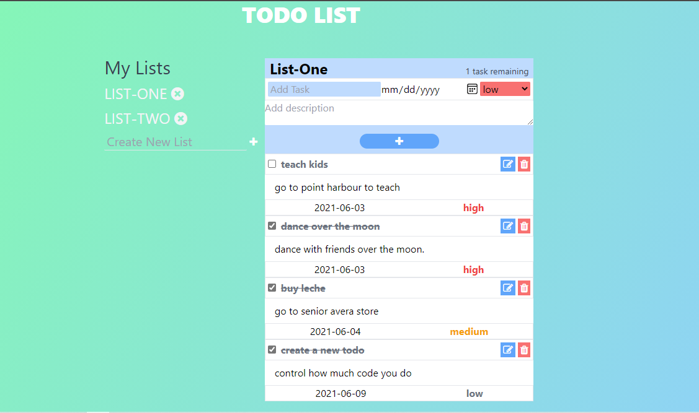

# Todo-list-app

## Table of contents

- [About](#about)
- [Features](#features)
- [Live Demo](#live-demo)
- [Built with](#built-with)
- [Getting started](#getting-started)
  - [Installation instructions](#installation-instructions)
- [testing](#tests)
- [Author](#author)
- [Show your support](#show-your-support)
- [License](#-license)

---

## About

A todo app where the user can Add/Edit/Delete todos. Todos are saved to the localStorage, so the user can access his lists and tasks anytime.



## Features

The features of this project are, user can:

1. Create lists of todo.
2. Add tasks to each list.
3. Delete and edit tasks
4. Delete lists

## Live Demo

This project is hosted on github pages.

[Live demo link](https://helciodev-todo-app.netlify.app/)

## Built With

- [](https://forthebadge.com)
- [](https://forthebadge.com)
- [](https://forthebadge.com)

## Getting Started

### Installation instructions

Follow along the steps below to get a copy at your local machine.

- Navigate to the directory where you want this project to clone and then clone it

  ```
  git clone git@github.com:helciodev/todo-list-app.git
  ```

- Navigate to the `todo-list-app` directory

  ```
  cd todo-list-app
  ```

- Install the npm package with `npm install`
- Start the server with `npm run start`
- The site should automatically open in your browser at http://localhost:8080/ if it didn't then open your browser with that link.

### tests
 To run tests run npm run tests in your command line
  ``` 
  npm run tests
   ```
## Author

😎 **Helcio André**

- GitHub: [@helciodev](https://github.com/helciodev)
- Twitter: [@helcio_bruno](https://twitter.com/helcio_bruno)
- Linkedin: [Helcio Andre](https://www.linkedin.com/in/helcio-andre/)

## 🤝 Contributing

Contributions, issues, and feature requests are welcome!

## Show your support

Give a ⭐️ if you like this project!

## 📝 License

This project is [MIT](./LICENSE) licensed.
